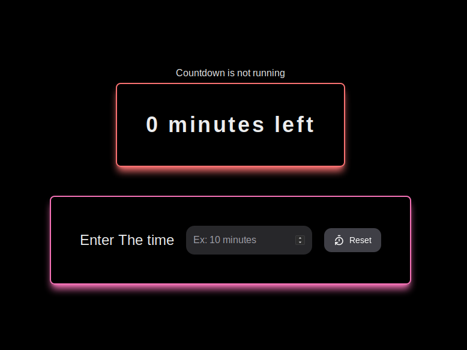

# Timer App

Build with Rust + Tauri + React



### What's the purpose:

Simple, Counting time backward. Enter a time such as, 10 minutes and it will
count backward. 10 min -> 9 min -> 8...

### Specialty:

1. Build with **RUST** based framework.
1. Cross platform
1. Small bundle size
1. Fast Startup

### Instructions:

_Prerequisites :_ Rust required to installed in the development system.

Install dependencies

```shell
npm install  //yarn or pnpm
```

Dev mode

```shell
npm run dev
```

Build Image

```shell
npm run tauri build
```

**That's It. Happy to receive any kind of feedback or contribution**
